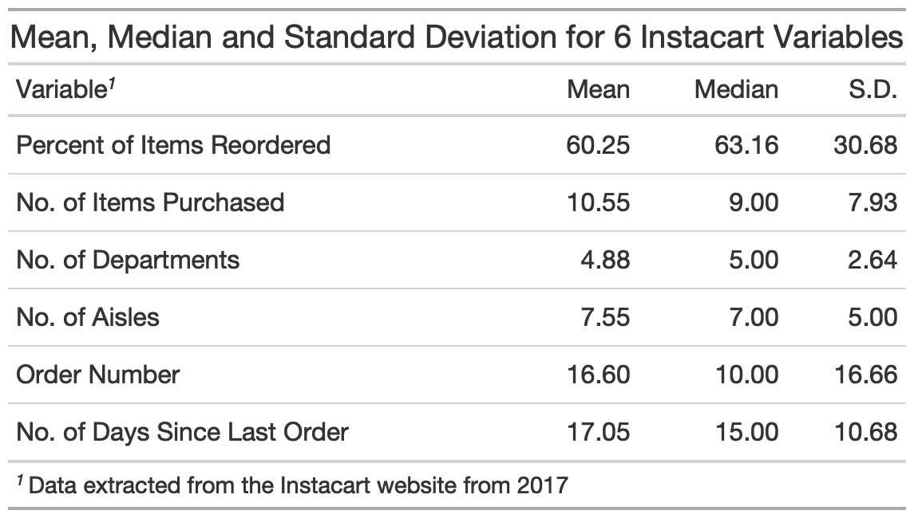
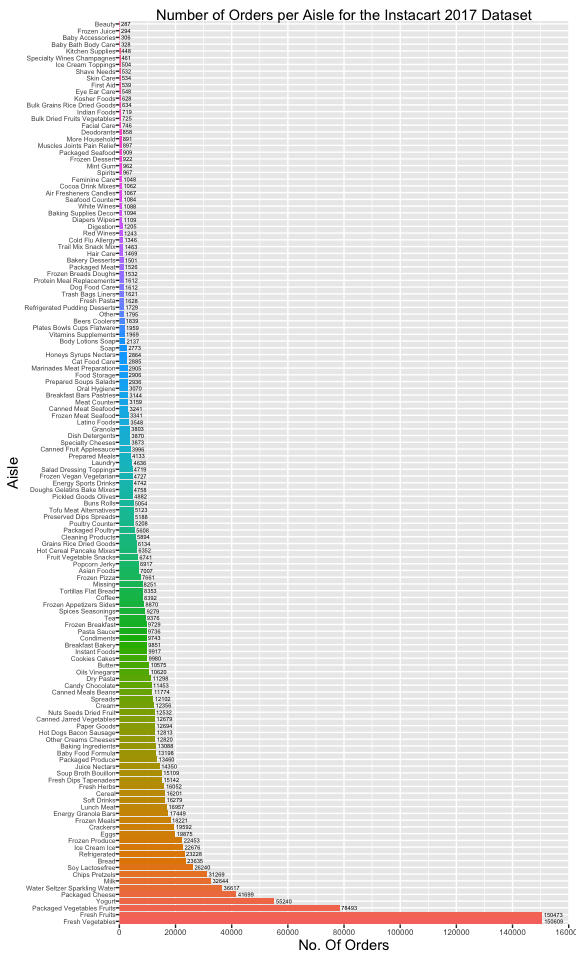
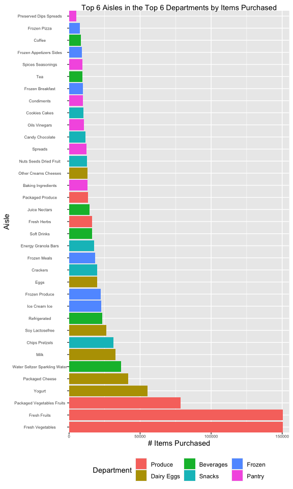
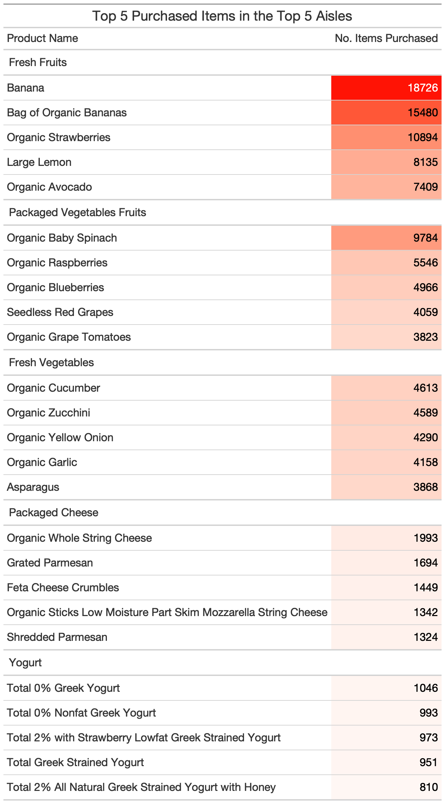

pubh7462\_hm3\_mjdasilv
================
Maykon da Silva
2/15/2022

# Problem 3. Instacart

``` r
# Reading in the data with relative path
instacart.df <- read.csv("./data/instacart.csv")
```

## 3.1 Please create a gt summary table which describes the overall mean, median, and sd of the number of days since last order, number of items purchased, number of aisles, number of departments, order number, and percent of items reordered; for all customers’ orders in these data.

``` r
# Creating 6 variables and running the summary statistics for each of them
instacart.summary <- instacart.df %>%
  group_by(order_id, user_id) %>%
  summarise(n.items         = max(add_to_cart_order),
            pct.reordered   = mean(reordered) * 100,
            days.last.order = unique(days_since_prior_order),
            n.depart        = length(unique(department)),
            n.aisle         = length(unique(aisle)),
            order.number    = unique(order_number)) %>%
  ungroup() %>%
  summarise(
    across(
      contains(c("pct.reo", "n.", "order.", "days.")),
               list(mean = mean, median = median, sd = sd),
               .names = "{.col}_{.fn}")) %>%
  ungroup()
```

``` r
# Creating the gt summary table from the summary statistics above
gt_summary_3.1 <- instacart.summary %>%
  pivot_longer(cols      = 1:18,
               names_to  = "variable",
               values_to = "value") %>%
  separate(variable, into = c("variable", "stat"), sep = "_") %>%
  pivot_wider(names_from  = "stat",
              values_from = "value") %>%
  mutate(across(where(is.numeric), round, 2)) %>%
  rename(Variable = variable, 
         Mean     = mean, 
         Median   = median, 
         S.D.     = sd) %>%
  mutate(Variable = recode(Variable, 
                                   pct.reordered    = "Percent of Items Reordered",
                                   days.last.order  = "No. of Days Since Last Order",
                                   order.number     = "Order Number",
                                   n.items          = "No. of Items Purchased",
                                   n.aisle          = "No. of Aisles",
                                   n.depart         = "No. of Departments")) %>%
  gt() %>%
  tab_header("Mean, Median and Standard Deviation for 6 Instacart Variables") %>%
  tab_footnote(
    footnote  = "Data extracted from the Instacart website from 2017",
    locations = cells_column_labels(
      columns = "Variable"))
```



## 3.2 Create a visualization in ggplot 2 which displays the number of orders (of all products) per aisle, with aisles ordered in a meaningful way.

``` r
# Counting the number of orders per aisle
plot_3.2 <- instacart.df %>%
  group_by(aisle) %>%
  summarise(n_orders = length(product_name)) %>%
  ungroup() %>%
  mutate(n_orders = as.numeric(n_orders)) %>%
  mutate(aisle = str_to_title(aisle)) %>%
  rename(Aisle = aisle, No.Orders = n_orders) %>%
  mutate(Aisle = as.factor(Aisle)) %>%
  mutate(Aisle = fct_reorder(.f = Aisle, .x = No.Orders, .desc = TRUE))

# Saving it as data frame to facilitate its use in ggplot (geom_col)
plot_3.2 <- as.data.frame(plot_3.2)

# Creating the ggplot of Number of Orders per Aisle
ggplot(plot_3.2, aes(x = Aisle, y = No.Orders, fill = Aisle)) +
  geom_col() +
  scale_colour_viridis_d("Aisle") +
  labs(title = "Number of Orders per Aisle for the Instacart 2017 Dataset",
       y     = "No. Of Orders") +
  theme(axis.text.x     = element_text(size  = 6, hjust = 0.5),
        axis.text.y     = element_text(size  = 5, hjust = 1),
        legend.position = "none") +
  geom_text(aes(label = No.Orders), size = 1.5, hjust = -0.1) +
  scale_x_discrete(expand = c(0,0)) +
  scale_y_continuous(
    limits = c(0, 160000), 
    breaks = seq(0, 160000, by = 20000), 
    expand = c(0,0)) +
  coord_flip()
```



## 3.3 What are the top 6 aisles in the the top 6 departments by items purchased? Create a ggplot 2 visualization which displays this information, with departments and aisles ordered in a meaningful way.

``` r
# Top 6 departments
top6_depart <- instacart.df %>%
  group_by(department) %>%
  summarise(count_dept = n()) %>%
  arrange(desc(count_dept)) %>%
  slice(1:6) %>%
  ungroup()

# Top 6 Aisles
top6_aisles <- instacart.df %>%
  filter(department %in% top6_depart$department) %>%
  group_by(department, aisle) %>%
  summarise(count_aisle = n()) %>%
  arrange(desc(count_aisle)) %>%
  group_by(department) %>%
  slice(1:6) %>%
  ungroup() %>%
  mutate(department = str_to_title(department) %>%
         as.factor() %>%
         fct_reorder(count_aisle, .desc = TRUE),
         aisle      = str_to_title(aisle) %>%
         as.factor() %>%
         fct_reorder2(department, count_aisle, .desc = TRUE))
 
# Top 6 Aisles and top 6 Departments plot 
top6_aisles %>%
  rename(Department = department) %>%
  ggplot(aes(x = aisle, y = count_aisle, fill = Department)) +
  geom_col() +
  theme(axis.text.x = element_text(angle = 0,
                                   size  = 6),
        axis.text.y = element_text(size  = 6)) +
  labs(x        = "Aisle", 
       y        = "# Items Purchased", 
       title    = "Top 6 Aisles in the Top 6 Departments by Items Purchased") +
  scale_x_discrete(expand = c(0,0)) +
  scale_y_continuous(limits = c(0, 155000), expand = c(0, 0)) +
  coord_flip()
```



## 3.4 What are the top 5 aisles by items purchased and what are the top 5 items purchased in each of those aisles?

``` r
# Top 5 Aisles by items purchased
top5_aisles <- instacart.df %>%
  group_by(aisle) %>%
  summarise(count_aisle = n()) %>%
  arrange(desc(count_aisle)) %>%
  slice(1:5) %>%
  ungroup()
  
# Top 5 Items per Aisle (gt table)
top5_items <- instacart.df %>%
  filter(aisle %in% top5_aisles$aisle) %>%
  group_by(aisle, product_name) %>%
  summarise(count_product = n()) %>%
  arrange(desc(count_product)) %>%
  group_by(aisle) %>%
  slice(1:5) %>%
  mutate(aisle = fct_reorder(aisle, count_product, mean)) %>%
  group_by(aisle) %>%
  mutate(aisle = str_to_title(aisle)) %>%
  arrange(desc(count_product)) %>%
  rename(
    "Aisle"               = aisle, 
    "Product Name"        = product_name, 
    "No. Items Purchased" = count_product) %>%
  gt() %>%
  tab_header("Top 5 Purchased Items in the Top 5 Aisles") %>%
  data_color(columns = "No. Items Purchased",
    colors = scales::col_numeric(
      palette = c("white", "red"),
      domain  = c(0, 19000)))
```


